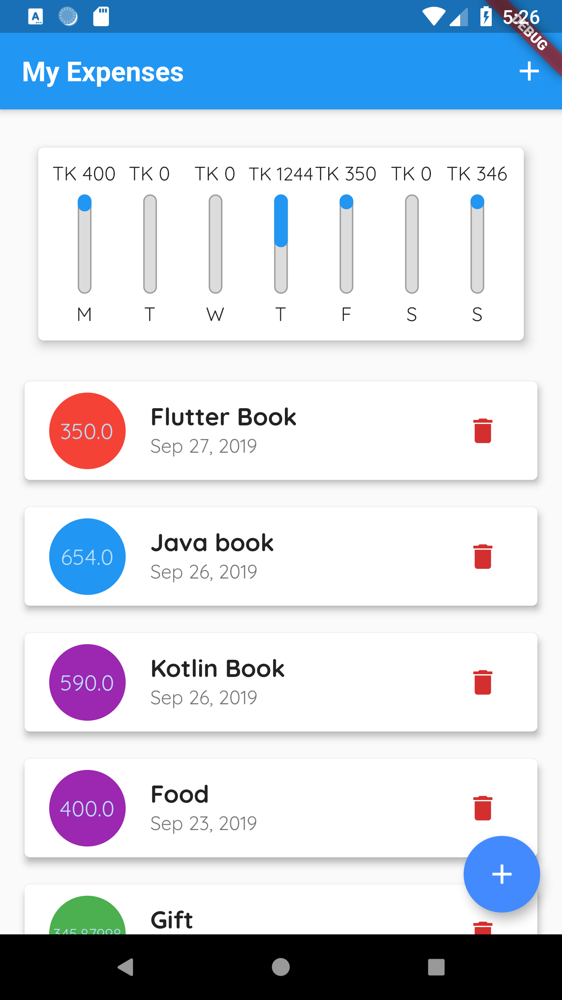
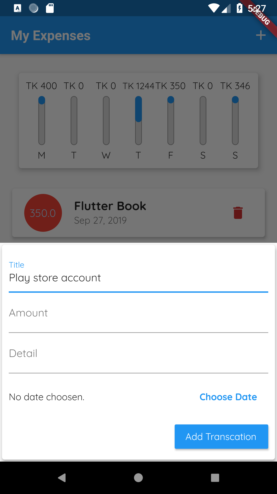
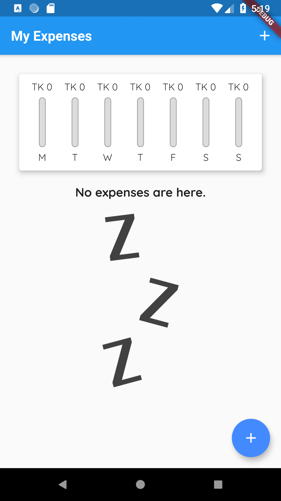
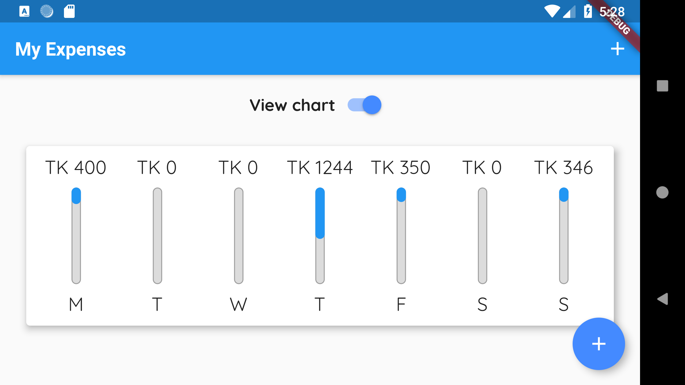
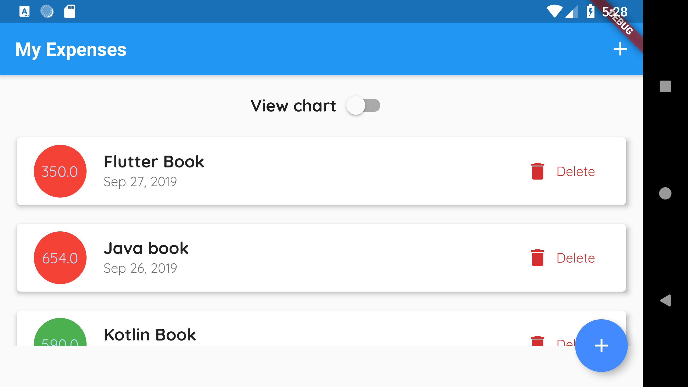

# simple expense keeper app
a simple expense keeper app (Flutter => different UI for Android & iOS)

 ## Screenshot 

(in portrait mode)
 List of expenses                           | Add new expense                             | Empty List           		                    
:------------------------------------------:|:-------------------------------------------:|:-------------------------------------------:
      |     |  
 
 
 (in landscape mode)
  View Chart                                 | List                                     		                    
 :------------------------------------------:|:-------------------------------------------:
       | 